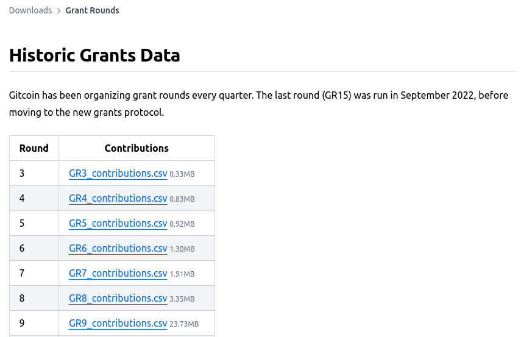
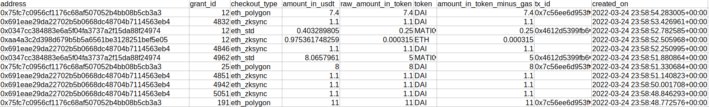
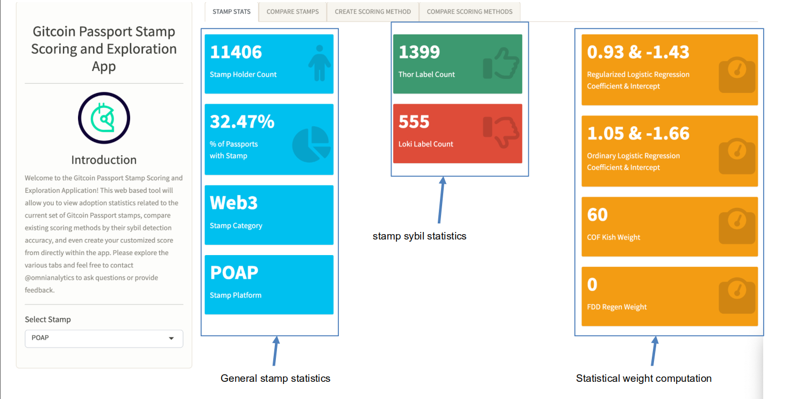
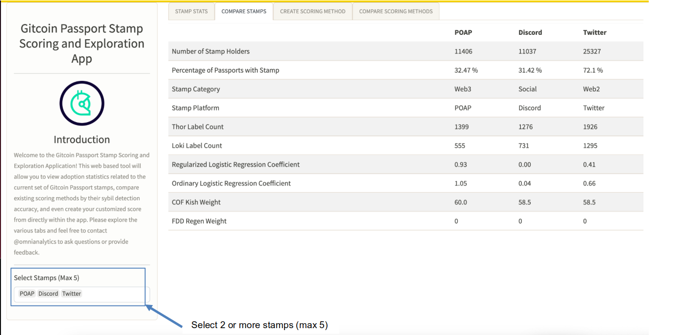
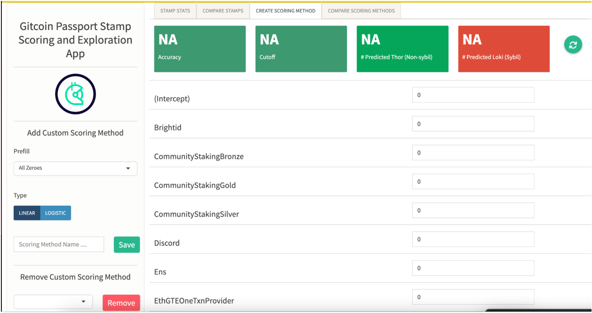
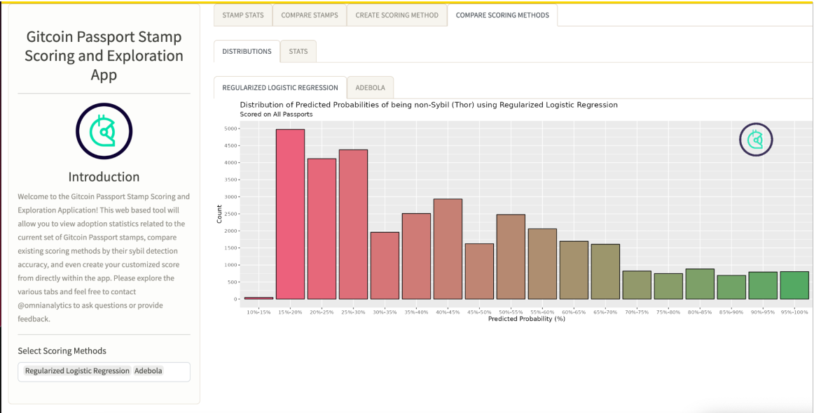
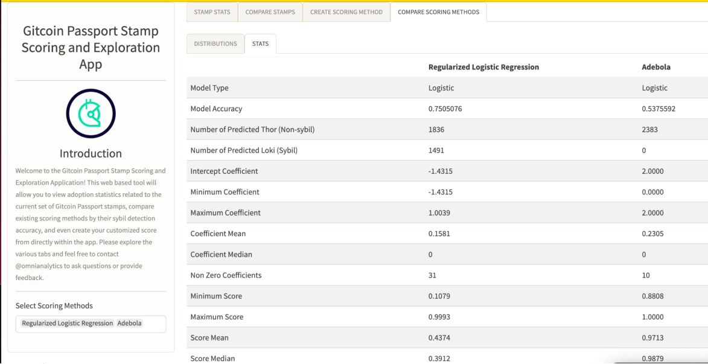

# lego-docs

This page contains documentation for Gitcoin Sybil defense Legos. Please use the table of contents below to navigate the page.

## Contents

- [lego-docs](#lego-docs)
  - [Contents](#contents)
  - [Introduction](#introduction)
    - [What is Sybil defense?](#what-is-sybil-defense)
    - [What are Legos?](#what-are-legos)
  - [Who uses Legos?](#who-uses-legos)
  - [What does a lego look like?](#what-does-a-lego-look-like)
  - [What Legos are already available?](#what-legos-are-already-available)
    - [Example use-cases](#example-use-cases)
      - [Example 1](#example-1)
      - [Example 2](#example-2)
      - [Example 3](#example-3)
  - [Building Legos](#building-legos)
    - [How do I build a Lego?](#how-do-i-build-a-lego)
    - [Lego spec](#lego-spec)
      - [Inputs](#inputs)
      - [Outputs](#outputs)
      - [Containerization](#containerization)
        - [Containeriation using Docker:](#containeriation-using-docker)
        - [What is Docker?](#what-is-docker)
        - [Why use Docker?](#why-use-docker)
        - [Containerization using Docker: Tutorial](#containerization-using-docker-tutorial)
    - [Contribution guidelines](#contribution-guidelines)
    - [Handling Gitcoin data](#handling-gitcoin-data)
    - [Documenting a new Lego](#documenting-a-new-lego)
  - [Roadmap](#roadmap)
    - [Lego ideas](#lego-ideas)
    - [UX/UI](#uxui)
    - [Performance](#performance)
  - [Lego Documentation](#lego-documentation)
    - [Gitcoin passport](#gitcoin-passport)
    - [Levenstein Distance](#levenstein-distance)
    - [Shared IP](#shared-ip)
    - [SAD model](#sad-model)
    - [DonorDNA](#donordna)
    - [GrantDNA](#grantdna)
    - [Onchain Intersectionality](#onchain-intersectionality)
    - [Scoring algorithm/aggregator](#scoring-algorithmaggregator)
  - [How to use the Gitcoin Passport stamp scoring app](#how-to-use-the-gitcoin-passport-stamp-scoring-app)
      - [Create a scoring method](#create-a-scoring-method)
      - [Compare existing scoring methods](#compare-existing-scoring-methods)
        - [Distribution:](#distribution)
        - [Stats:](#stats)
  - [Resources](#resources)
    - [FAQs](#faqs)
    - [Read/Watch/Listen](#readwatchlisten)


## Introduction

### What is Sybil defense?

Sybils are "fake" users. They are users that do not represent real humans. Sybils are created in order to make a single human appear to be many in order to have outsized weight in a voting protocol or to receive more than a single person's worth of some reward (e.g. an airdrop). These Sybils should be eliminated from a fair voting/funding protocol, but theyare no always easy to detect.


Do Androids Dream of Electric Sheep tells the story of a detective tasked with eliminating humanoid "replicants" that are almost indistinguishable from natural humans. They do this using a system of tests, including an instrumented interview that look for subtle "tells" such as a limited ability to make complex moral judgments in hypothetical scenarios. Sybil defenders are similarly tasked with distinguishing real and virtual humans in a mixed population where they are difficult to tell apart. They too look for subtle "tells" that give Sybils away. Sometimes the Sybil signals are obvious and unambiguous, sometimes they are not. The additional complication for Sybil hunters is that the entire population exists in a digital space where a human's physical existence cannot be proven by their presence- it can only be demonstrated using forgeable proxies. Reliably linking actions to identities is therefore a subtle science that pieces together multiple lines of evidence to build a personhood profile.

[](https://youtu.be/v1Dm7FI2AdU "Sybil defense introduction")

For Gitcoin grants, Sybil detection is extremely important because minimizing the influence of Sybils creates a funding environment that more accurately represents the true preferences of the community of donors. Sybils skew the allocated funds in favour of individual projects to benefit some specific user or group, rather than efficiently distributing funds to genuine public goods. Gitcoin aims to solve for one-human one-vote, while Sybils actuively try to subvert that and unfairly allocate more votes to fewer humans.

To date, Sybil defense has been executed by a small group of Gitcoin data scientists manually applying algorithms to user data and reviewing disputes. Now, as Gitcoion becomes a protocol, Sybil defense will be executed in a more decentralized way. This requires composable tools for Sybil defense that can be applied to open data. These composable tools are known as Sybil defense Legos because they can be recombined and reconfigured to built bespoke defense strategies fit for specific purposes.

### What are Legos?

Gitcoin is decentralizing by converting the core Sybil defense functions into a set of tools that can easily be implemented by users or eventually forked and recombined in creative ways in other projects. This requires the Sybil defense procedures currently managed by humans to be broken down into discrete units, defined in code, documented and made accessible as composable building blocks. These are known as "Legos". Lego bricks are simple building blocks that can be connected to each other in creative combinations to form all kinds of structures or even machines that are much more complex than their component parts. Similarly, modular, composable software tools can be used to build imaginative systems for defending against Sybils. 


For Gitcoin grants, Legos start as useful insights from analysis of Gitcoin data - some metric that reveals users to be Sybils. Then, this finding is expressed algorithmically and turned into some executable code. The ideal scenario we are workijg towards is for the Legos to be executable with no coding required, probably through a web interface where Lego's can be selected to be executed remotely, returning a simple result to the user. 

In summary:

Each Lego is an analysis which is known to be evidence that an account is Sybil. 

## Who uses Legos?

The primary user persona for fraud defense tools is the “Fraud Consultant”. This is a person who understands the past sybil attacks and steps taken to mitigate them. They are not only able to consult program & round operators, but also other uses of Passport, Project, and Program protocols.

The second user persona for fraud defense tools is the “Round Operator”. Most likely this will be someone on the Gitcoin PGF workstream team for early rounds. Their primary interest is maintaining a happy community where funders and donors both feel that capital is optimally distributed in their program (or at least as close as possible).

The “round operator” is the persona of someone focused on a single instance of a grant round voting event. The term “program operator” is referring to the operator of multiple rounds for the same program. Imagine Uniswap hosts 4 rounds per year. The program operator and round operator are likely, but not necessarily the same person. “Event operator” further abstracts this role to include events which are not Gitcoin Grants related such as a vote on snapshot (which has integrated Passport).

## What does a lego look like?

A "Lego"is a discrete unit that performs one, specific function in the Gitcoin protocol. It should work as a building block, meaning that it should be deployable on its own, taking well defined inputs and returning some known outputs. It should also connect to other Legos, which requires some standardization of types and formats for inputs and outputs so that tools can be chained together in intuitive pipelines. Making these Lego's available empowers the community to build on top of them and saves developers from having to repeatedly reinvent the wheel when building out new products.

For a truly composable Lego, the code should be:

- **Tightly scoped**: the tool should fulfill one single function without side-effects so that it can be deployed in a variety of contexts with reliable outcomes.
- **Free and open**: open source codes that is publicly available, auditable, able to run on normal consumer hardware.
- **Permissionless**: not requiring special credentials or licenses to view, download or deploy, and users have the ability to fork the code any time.
- **Accessible**: sufficiently well-documented and with intuitive UX to enable a wide community of users
- **Minimal dependencies**: protect the "supply chain" by minimizing the dependencies. Where dependencies are unavoidable, bundle them or make them very easy to access.
- **Modular**: uses common formats and types so that outputs of one Lego can become inputs to another in pipelines - i.e. the legos are designed to be used as building blocks for larger systems with no specific predetermined structure.
- **Open governance**: Decisions about the development of the Lego's should not be gated by individuals or centralized groups - instead governance should be open so that users can trust that the code will be developed and maintained with integrity and community participation. 

Some examples of Lego's that conform to these norms are smart contracts on Ethereum. Smart contracts, or even individual functions of smart contracts, can be forked and rewritten, or stacked on top of each other in creative ways to build new protocols. This is common practise in DeFi, where primitives such as asset borrowing, lending and staking contracts are combined in many different ways by teams aiming to create protocols optimized for yield, or resilience, or security. Token standards such as ERC-20 (Ethereum token standard) and ERC-721 (Ethereum NFT standard) are composable primitives that can be built on top of - there is a huge diversity of token and NFT projects built on top of these original standards, often in combination with DeFi Legos, creating a diverse landscape of decentralized financial products and a community with freedom and agency to create new versions and implement new ideas.

We want to bring that freedom and agency to public goods funding. Rather than being centralized overseers of public goods funding, we want to share tools that empower the community to do it in clever and creative new ways.

## What Legos are already available?

Several Lego's are already being used to manage Sybils in Gitcoin grants. These are:

- **Gitcoin Passport:** When a user connects a passport, a trust score can be calculated for them which is used as evidence of personhood - the greater the score the more likely they are to be a genuine user.
- **Levenstein distance:** Every user has a username - when they sign up to Gitcoin grants the similarity of their name can be compared against all other usernames to generate a likelihood of the username being auto-generated - evidence of a Sybil account. This Lego **will be deprecated** in the grants protocol because usernames will no longer be available - only Ethereum addresses, wallet IDs and grant/round nonce. 
- **Shared IP**: User IP addresses can also be checked to see if they are shared with many other users. Lots of addresses originating from the same IP could be a marker for Sybil attackers.
- **SAD model:** The user also has a Gitcoin account whose history can be analyzed using the SAD model to give another Sybil-likelihood score.
- **DonorDNA**: When a donor connects their wallet their profile of past donations can be analyzed to see whether it is similar to groups of other users, which may be indicatative of Sybil rings.
- **GrantDNA**: Each grant has a set of donors that can be represented as a set of binary data. This can be used to compare grants against flagged grants to see if they have similar donor profiles.
- **Onchain Intersectionality**: How many out of a set of on-chain credentials does a user have?

The outputs from these Legos are collated into a single dataset where each user has a Sybil likelihood as measured across several dimensions. A threshold value that separates "suspicious" and "not suspicious" users can be applied to each metric individually such that the final dataset is a set of Booleans for each user, and the final decision about whether to omit or allow a particular user is a simple summation (e.g. if sum > 3, squelch). Alternatively, the actual value from each metric can be propagated to the final dataset and a (weighted) average applied there to identify Sybils. Either way, the outputs from the Legos themselves are aggregated and used collectively to come to a decision about the trustability of the user. In summary, the Legos are run independently and the results passed to an aggregator. The user sees the result of each independent Lego and also the result of the aggregator - i.e. they get an overall Sybil likelihood score/trust score and also a break down of the individual Sybil "dimensions".


### Example use-cases

Here are a few examples of how this will work in practice, for Gitcoin Grants specifically.

#### Example 1 

A Program/Round Operator would like to “gate” access to voting in a QF/QV vote. A Gitcoin Fraud Analyst might recommend that they use some combination of stamps or Passport score to gate their particular round.

Passport Scores are instance-specific and are applied by the event operator. A passport score may be applied to a user when participating in a vote/round. They may apply a score when the user joins a community. How a score is used is always on the event operator side of the system. The ability to update or change a score is therefore irrelevant because the event operator can always choose to modify how they interpret an existing score provided by Gitcoin or anyone else. Criteria might include:

- A set of specific stamps a user MUST have
- A number of total stamps a user MUST have
- Use the Boolean Output of one of Gitcoin’s Passport Scoring as a Service (PSaaS) models
- Use a combination of "PSaaS + another requirement
- Design custom set of stamp weights (or download another user/community list)
- An event operator can always create an “escape hatch” where a user who is denied can do some other action to “prove” they should be allowed

#### Example 2

A Program/Round operator would like to gate access to only users who have a passport without any stamp/scoring requirements. They instead wish to “weight” the users voice in the vote. The reason they would use Passport stamps for weighting rather than onchain wallet signals is because Passport provides a shared ETL layer for their community to verify, validate, and reproduce algorithmic policy decisions.

Simple algorithms:

- decrease weight by 50% if less than 2 stamps
- increase weight by 100% if more than 2 stamps

Complicated algorithms:

- Quadratically increase voice for each stamp a user has
- Create custom teir levels of stamps with associated voice benefits if user has x & y stamps, then use the PSaaS to weight their voice
- PSaaS Cost of Forgery Model

Complex algorithms:

- PSaaS regression models
- Create a custom ML model
- Host your own community semi-supervised reinforcement learning model

#### Example 3 

A Program/Round operator would like to hold the right to “squelch” (apply a 0 coefficient) to a user during or after the round based on behavior during the round.

Uses the complete Fraud Defense Stack during the round to assign a subset of users to “Thor & Loki datasets” (for sure sybil & not sybil) which can be used to run a standardized Machine Learning model against using Passport Stamps as the only features in the model. At first this seems  counter-productive, but the purpose of doing this is to allow the community to verify and reproduce the results, validate the ML model, and have humans evaluate the Thor & Loki datasets (Gitcoin training datasets containing known honest users and known Sybils).


## Building Legos

### How do I build a Lego?

In essence, building a Lego means coding up some algorithm that demonstrably has Sybil-detecting efficacy and wrapping it in helper functions that enhance its useability. A common workflow might be:

1) Exploratory analysis of gitcoin data that reveals some Sybil predictor
2) Encoding of the algorithm as a script in preferred language
3) Wrapping of the algorithm in helper functions for data wrangling, cleaning, and output formatting
4) Containerization, e.g. using Docker, to remove dependency friction for users
5) Writing clear documentation on this page and/or elsewhere that enables others to use the Lego

The following sections explain this in more detail, startign with the "Lego spec" where the desirable properties for a new Lego are defined.

### Lego spec

This section details the desired properties for a new Lego.

#### Inputs

The Lego should only require some subset of the following data as inputs:

  - Ethereum address: User's Ethereum address
  - Passport ID: User's Gitcoin passport digital identifier
  - Grant round nonce: A counter that tracks the number of donations a user has made in a round 

#### Outputs

The Lego should output one or both of:

- a Boolean: representing Sybil or non-Sybil as predicted by the Lego
  - 1 = Sybil, 0 = non-Sybil
- a float: representing the Sybil likelihood or "trust score" as predicted by the Lego.
  - higher score = greater likelihood of being Sybil (`trust = 1-score`)

#### Containerization

Containerization is the packaging of software code with just the operating system (OS) libraries and dependencies required to run the code to create a single lightweight executable—called a container—that runs consistently on any infrastructure. More portable and resource-efficient than [virtual machines (VMs)](https://www.ibm.com/topics/virtual-machines), containers have become the de facto compute units of modern cloud-native applications. Containerization allows developers to create and deploy applications faster and more securely. With traditional methods, code is developed in a specific computing environment which, when transferred to a new location, often results in bugs and errors.

The concept of containerization and process isolation is actually decades old, but the emergence in 2013 of the open source Docker engine, an industry standard for containers with simple developer tools and a universal packaging approach—accelerated the adoption of this technology.

##### Containeriation using Docker:

Step 1: Application structure

Step 2: Build/Import codes for containerization.

Step 3: Outlining key requirements

Step 4: Create a docker file

Step 5: Perform the docker compose

Step 6: Building and testing

##### What is Docker?

Docker is “a computer program that performs operating-system-level virtualization, also known as ‘containerization’” Wikipedia. As any first line of a Wikipedia article about tech, this sentence is obscure to anyone not already familiar with the content of the article.

So, to put it more simply, Docker is a program that allows to manipulate (launch and stop) multiple operating systems (called containers) on your machine (your machine will be called the host). Just imagine having 10 RaspberryPi with different flavors of Linux, each focused on doing one simple thing, that you can turn on and off whenever you need to ; but all of this happens on your computer.

##### Why use Docker?

Docker is designed to enclose environments inside an image / a container. What this allows, for example, is to have a Linux machine on a Macbook, or a machine with R 3.3 when your main computer has R 3.5. Also, this means that you can use older versions of a package for a specific task, while still keeping the package on your machine up-to-date.

This way, you can “solve” dependencies issues: if ever you are afraid dependencies will break your analysis when packages are updated, you can build a container that will always have the software versions you desire: be it Linux, R, Python or any other software package.

##### Containerization using Docker: Tutorial

Here are the prerequisites:

- Basic understanding of R and [Flask.](https://flask.palletsprojects.com/en/2.2.x/)
- Basic understanding of the command line.
- A code editor (IDE) such as VS Code or R studio.

Install Docker and Docker Compose via the links below:

- [Docker](https://www.section.io/engineering-education/how-to-containerize-a-python-application/www.docker.com)
- [Docker Compose](https://docs.docker.com/compose/)

Note that this tutorial assumes the user wants to use a preconfigured official R image. There are many alternatives - search the [Docker Hub](https://hub.docker.com/) for images that suit your specific needs.

**Docker image Vs Docker containers**

On your machine, you’re going to need two things: images, and containers. Images are the definition of the OS, while the containers are the actual running instances of the images. You’ll need to install the image just once, while the containers are to be launched whenever you need this instance. And of course, multiple containers of the same images can be run at the same time. To compare with R, this is the same principle as installing vs loading a package: a package is to be downloaded once, while it has to be launched every time you need it. And a package can be launched in several R sessions at the same time easily.

So to continue with this metaphore: we’re building an image when we’re install.packages(), and we run the image when we library().

**Docker File**

A Docker image is built from a Dockerfile. This file is the configuration file, and describes several things: from what previous docker image you are building this one, how to configure the OS, and what happens when you run the container. It describes which are the dependencies to your package, gives meta information, and states which functions and data are to be available to the users.

So, let’s build a very basic Dockerfile for R, focused on reproducibility. The idea is this one: I have today an analysis that works (for example contained in a .R file), and I want to be sure this analysis will always work in the future, regardless of any update to the packages used.

So first, create a folder for your analysis, and a Dockerfile:

```jsx
*mkdir ~/mydocker*
```

```jsx
*cd ~/mydocker*
```

```jsx
*touch Dockerfile*
```

And let’s say this is the content of the analysis we want to run, called `myscript.R`, and located in the `~/mydocker` folder:

```jsx
*library(tidystringdist)*
```

```jsx
*df <- tidy_comb_all(iris, Species)*
```

```jsx
*p <- tidy_stringdist(df)*
```

```jsx
*write.csv(p, "p.csv")*
```

**FROM**

Every Dockerfile starts with a `FROM`, which describes what image we are building our image from. There are a lot of official images, and you can also build from a local one.

This `FROM` is, in a way, describing the dependency of your image. If you’re going for an R based image, Dirk Eddelbuettel & Carl Boettiger are maintaining rocker, a collection of Docker images for R you can use. The basic image is `rocker/r-base`, but what we want is our image to be reproducible: that is to say to rerun the exact same way anytime we run it. For this, we’ll be using `rocker/r-ver`, which are Docker images containing a fixed version of R (back to 3.1.0), and that you can run as if from a specific date. So what we’ll do is look up the image corresponding to the R version we want. You can get your current R Version with:

```jsx
*R.Version()$version.string*
```

```jsx
*## [1] "R version 3.6.1 (2019-07-05)"*
```

```jsx
So, let’s start the Dockerfile with:
```

```jsx
*FROM rocker/r-ver:3.4.4*
```

**RUN**

Now we’ll add some `RUN` statements. These are commands which mimic command line commands. we’ll create a directory to receive our analysis.

```jsx
*FROM rocker/r-ver:3.4.4*
```

```jsx
*RUN mkdir /home/analysis*
```

**Install our package**

The command to make R execute something, from the terminal, is `R -e "my code"`. Let’s use it to install our script dependencies, but from a specific date. We’ll mimic the way `rocker/r-ver` works when building from a specific date: setting the options("repos") to this specific date, using the MRAN image: in other word, using a repo url like https://mran.microsoft.com/snapshot/1979-01-01.

```jsx
*FROM rocker/r-ver:3.4.4*
```

```jsx
*RUN mkdir /home/analysis*
```

```jsx
*RUN R -e "options(repos = \*
```

```jsx
*list(CRAN = 'http://mran.revolutionanalytics.com/snapshot/2019-01-06/')); \*
```

```jsx
*install.packages('tidystringdist')"*
```

**Making it more programmable with ARG**

In our last Dockerfile, the date can’t be modified at build time - something we can change if we use an ARG variable, that will be set when we’ll do docker build, with `--build-arg WHEN=`

```jsx
*FROM rocker/r-ver:3.4.4*
```

```jsx
*ARG WHEN*
```

```jsx
*RUN mkdir /home/analysis*
```

```jsx
*RUN R -e "options(repos = \*
```

```jsx
*list(CRAN = 'http://mran.revolutionanalytics.com/snapshot/${WHEN}')); \*
```

```jsx
*install.packages('tidystringdist')"*
```

Here, the `{tidystringdist}` that will be installed in the machine will be the one from the date we will specify when building the container, even if we build this image in one year, or two, or four.

**COPY**

Now, I need to get the script for my analysis from my machine (host) to the container. For that, we’ll need to use `COPY` localfile path in the container. Note that here, the `myscript.R` has to be in the same folder as the Dockerfile on your computer.

```jsx
*FROM rocker/r-ver:3.4.4*
```

```jsx
*ARG WHEN*
```

```jsx
*RUN mkdir /home/analysis*
```

```jsx
*RUN R -e "options(repos = \*
```

```jsx
*list(CRAN = 'http://mran.revolutionanalytics.com/snapshot/${WHEN}')); \*
```

```jsx
*install.packages('tidystringdist')"*
```

```jsx
*COPY myscript.R /home/analysis/myscript.R*
```

**CMD**

Now, `CMD`, which is the command to be run every time you launch the docker. What we want is `myscript.R` to be sourced.

```jsx
*FROM rocker/r-ver:3.4.4*
```

```jsx
*ARG WHEN*
```

```jsx
*RUN mkdir /home/analysis*
```

```jsx
*RUN R -e "options(repos = \*
```

```jsx
*list(CRAN = 'http://mran.revolutionanalytics.com/snapshot/${WHEN}')); \*
```

```jsx
*install.packages('tidystringdist')"*
```

```jsx
*COPY myscript.R /home/analysis/myscript.R*
```

```jsx
*CMD R -e "source('/home/analysis/myscript.R')"*
```

**Build, and run**

**Build**

Remember what we want: an image that will run an analysis exactly as we defined today, even if it is actually run far in the future. To do this, we’ll use the `--build-arg WHEN=` argument for the docker build. Just after the `=`, put the date you want your analysis to be run from.

Now, go and build your image. From your terminal, in the directory where the Dockerfile is located, run:

```jsx
*docker build --build-arg WHEN=2019-01-06 -t analysis .*
```

`- t name` is the name of the image (here `analysis`), and `.` means it will build the Dockerfile in the current working directory.

**Run**

Then, just launch with:

```jsx
*docker run analysis*
```

And your analysis will be run.

**Export container content**

One thing to do now: you want to access what is created by your analysis (here `p.csv`) outside your container ; i.e, on the host. For now, everything that happens in the container stays in the container. So what we need is to make the docker container share a folder with the host. For this, we’ll `Volume`, which are (roughly speaking), a way to tell the Docker container to use a folder from the host as a folder inside the container.

That way, everything that will be created in the folder by the container will persist after the container is turned off. To do this, we’ll use the `-v` flag when running the container, with `path/from/host:/path/in/container`. Also, create a folder to receive the results in both:

```jsx
*FROM rocker/r-ver:3.4.4*
```

```jsx
*ARG WHEN*
```

```jsx
*RUN mkdir /home/analysis*
```

```jsx
*RUN R -e "options(repos = \*
```

```jsx
*list(CRAN = 'http://mran.revolutionanalytics.com/snapshot/${WHEN}')); \*
```

```jsx
*install.packages('tidystringdist')"*
```

```jsx
*COPY myscript.R /home/analysis/myscript.R*
```

```jsx
*CMD cd /home/analysis \*
```

```jsx
*&& R -e "source('myscript.R')" \*
```

```jsx
*&& mv /home/analysis/p.csv /home/results/p.csv*
```

```jsx
*mkdir ~/mydocker/results*
```

```jsx
*docker run -v ~/mydocker/results:/home/results  analysis*
```


Wait for the computation to be done, and…


```jsx
*ls ~/mydocker/results*
```

```jsx
*P.csv*
```

**What to do next?**

So now, every time you’ll launch this Docker image, the analysis will be performed and you’ll get the result back. With no problem of dependencies: the packages will always be installed from the day you desire. Although, this can be a little bit long to run as the packages are installed each time you run the container. But as I said in the Disclaimer, this is a basic introduction to Docker, R and reproducibility, so the goal was more to get beginners on board with Docker :)

Other things you can do include:

- Use `remotes::install_version()` if you want your analysis to be based on package version instead of a time based installation	.

```jsx
*FROM rocker/r-ver:3.4.4*
```

```jsx
*RUN R -e "install.packages('remotes'); \*
```

```jsx
*remotes::install_version('tidystringdist', '0.1.2')"*
```

```jsx
*…*
```

- Use the `Volume` trick to bring data into your container, so that any data will be analysed in the very same environment.


### Contribution guidelines

To contribute to this documentation, please raise a pull request against this repository. There are two options for doing this:
1) clone this repository and create updates in fresh branches. Raise pull requests from your new branch to `main`
2) Fork this repository so you have your own copy. Clone your fork, and raise pull requests from there.

For more information on how to raise a PR, see [this guide](https://docs.github.com/en/pull-requests/collaborating-with-pull-requests/getting-started/about-collaborative-development-models). 

You can also request changes by raising issues in this repository. The code owners will review the issue board regularly and do their best to accommodate reasonable requests.

To contribute to Lego development, one of the best ways is to participate in one of the [community hackathons](https://github.com/orgs/OpenDataforWeb3) (there have been two so far). New ideas for Legos can always be discussed with the Gitcoin community on the Gitcoin discord server. Anyone can create a Lego at any time, but it is recommended to reach out to folks in the Gitcoin and Gitcoin Passport community to avoid duplicating efforts!

⚠️ For documentation purposes, please avoid uploading files such as docx, pdf, etc. to our github. Ideally PRs will directly update the README - i.e the relevant changes are made by the contributor, not the PR reviewer/code owners. Then they can be edited, reviewed and merged collaboratively and transparently. 


### Handling Gitcoin data

Gitcoin data can be downloaded from [fddhub.io](https://fddhub.io/downloads/grant_rounds). This includes historic round data dating back to Grants Round 3.



The data is available as csv files for each grant round. Inside the csv file, the data are organized with each column representing a variable and a row per user. The variables are:

- **address**: user's Etheruem address
- **grant_id**: unique identifier for a grant
- **checkout_type**: what was the payment network? (e.g. ZK-sync, Polygon, Ethereum Mainnet)
- **amount_in_usdt**: value of donation in US dollars
- **raw_amount_in_token**: value of the donation denomninated in the donated token
- **token	amount_in_token_minus_gas**: value of the donation after gas is subtracted
- **tx_id**: unique identifier for the transaction (onlky available for n on-privacy preserving networks - i.e. not available for ZK platforms)	
- **created_on**: date donation was sent



### Documenting a new Lego

If you build a new Lego, it is important to explain how it works to others in the community. Your Lego might require some detailed documentation that you may wish to host independently. However, it is also improtant to make your Lego visible to the rest o the Sybil defense community. This page is a great way to do that, and it can become a go-to resource for Lego builders and users. To add documentation to this page:

1) Add the Lego name and a one-line description to the bullet list in [What Legos currently exist](#what-legos-are-already-available)
2) Create a H3 header (title preceded by three hashes) for your Lego. The header should be your Lego name. Put this in the [Lego documentation](#lego-documentation) section of this page (i.e. copy the formatting from the other subsections in Lego Documentation)
3) In that new section, add documentation for your Lego. This should include some background to help readers understand the concept, some information about the analysis done to verify Sybil-detection efficacy, and intructions for how the Lego should be used.
4) Add a link to the Github repository for your Lego source code. Also link to any other implementations (e.g. web app).
5) Let us know in the Gitcoin discord and/or on Twitter!


## Roadmap

### Lego ideas

During Season 14, Gitcoin Passport was integrated into Bankless Academy. Analysis revealed that Gitcoin Passport was most powerful when combined with additional anti-Sybil Legos.

- **Farmer Boolean**: (uses on-chain data to determine whether a user has >X ERC-20 tokens and an average transaction value <Y ETH)
- **Onchain History Boolean**: (has a user engaged in certain web3 activities in a specific timeframe? Activites and timeframe can be customized by round owner)
- **Money-Mixer**: (Does a user interact with mixers e.g. Tornado cash)
- **On-Trend / Off-Trend**: (is the donation profile of a user similar to a grant’s target community?)
- **Flagged Activity on Etherscan**: (is an address closely associated with addresses flagged as phishing/spam on etherscan?)

There are many possibilities for more Legos - any analysis that can be shown to be indicative of Sybil behaviour and implementable as an algorithm could be turned into a Lego. Some might be relatively complex analyses of on-chain data, like detecting when a user has rapidly swapped funds back and forth in order to seem more active. Sequences of rapid transactions between wallets, especially when they are ultimately returned to where they started or at least stay within a small group of addresses, could be a Sybil behaviour. Other on-chain indicators might be whether a wallet was initially funded from a contract, as this might be a way for Sybil attackers to automate their donations from many externally-owned accounts.

Other simple Legos could be checks for users that hold certain POAPs or NFTs. Some POAPs and NFTs are easy to farm, others require significant investment of time and/or capital. For example, some education programs award their graduates NFTs as proof of completion - those are difficult to farm without taking a course, and they are in very limited supply so the total bribable population is small - ownership of these credentials is good evidence a user is not a Sybil attacker.

Some specific NFTs and POAPs might be especially high-signal for certain communities - e.g. POAPs distributed in community calls or at in-person meetups. There is also high potential for creating Legos based on past behaviours and interactions with other grant rounds - e.g. has a particular address donated to grants that have been flagged as fraudulent in the past - if so, how often? If some threshold of a user’s donations, say 50%, have gone to flagged grants, the user gets flagged too.

Not all Legos have to use on-chain data. There may be more Sybil signals that can be extracted using clever analysis of Gitcoin data - DonorDNA and GrantDNA are good examples of existing Legos that only use off-chain data.

### UX/UI

Right now, these Legos exist as code that is run manually by data scientists. The code is run against individual Ethereum addresses and Gitcoin usernames to determine their Sybil-likelihoood. They are currently run as independent, standalone algorithms, although development is tending towards increased automation and interoperability so that users are better able to implement these algorithms for themselves.

Ultimately, UX improvements are necessary for these Legos to be decentralized and maximully powerful in a protocol-based grants platform. This can be a stepwise process, first making the Lego code as accessible as possible with clear documentation and examples, then making it easy to execute in a minimal code workflow using, for example, containers. Then, the ultimate form would be no-code implementations where the Lego execution is abstracted away behind a web-app or similar graphical interface. 

The image below shows a prototype "Sybil dashboard". A user has input their user addresses into a web app and the dashboard is displaying the Lego predictions for their users. This allows a round owner to tell whether their round is under attack. 


### Performance

There will necessarily be costs associated with executing some Legos. This means there is value in refining existing Legos to make them more efficient. For example, there may be cost savings associated with refactoring Python/R code to vectorize as much as possible and minimize loops, or perhaps replacing (e.g.) Python code designed to execute in a virtual machine with (e.g.) compiled C code that implements the same algorithm. The end-user should not notice the change, as they still only interact with a user-interface that chooses a Lego, but the cost to execute the Lego is decreased.

Read more about the [Lego development roadmap](https://gov.gitcoin.co/t/public-goods-legos-roadmap/12546).

## Lego Documentation
### Gitcoin passport

Gitcoin passport have their own [documentation website](https://docs.passport.gitcoin.co/) that includes detailed instructions for creating and using a Passport, integratign new stamps, using Gitcoin Passport in decentralized applications and everything else a developer or user might nee to understand and work with the Gitcoin Passport technology. There is also a Gitcoin Passport SDK (software development kit) for building new applications.

### Levenstein Distance
### Shared IP
### SAD model
### DonorDNA
### GrantDNA
### Onchain Intersectionality
### Scoring algorithm/aggregator

## How to use the Gitcoin Passport stamp scoring app

Passport is a decentralized identifier. Users collect “stamps” from different authenticators around web2 and web3, such as Bright ID and Proof of Humanity. Stamps are verifiable credentials – by aggregating several of them in one place, Passport distributes trust across multiple entities. After integrating with Passport, instead of relying on a middleman to verify someone’s identity, dApps can verify it themselves with a customizable algorithm that weights different stamps according to their preferences, essentially allowing communities to create a customizable visa with their participation requirements. The passport stamp scoring and exploration app is a web based tool that allows you to view adoption statistics related to the current set of Gitcoin Passport stamps, compare existing scoring methods by their sybil detection accuracy, and even create your customized score from directly within the app. The application comprises a total number of 54 stamps that can be used for different computations.

The homepage of this application comprises five tabs, each of which will be discussed in detail in the subsequent sections. 



The passport stamp and scoring app (PSSA) has on its homepage, a stamp statistic tab. In this tab, users can get information and statistics on various stamps.



Click the select stamp drop down menu at the bottom left of the homepage, select the stamp you want to get information and/or statistics. Prevalent 
amongst these statistics are:

1. Stamp Holder count: This displays the number of gitcoin users who holds the stamp
2. Percentage of passports with stamps: This shows the percentage of gitcoin users that have the selected stamp on their passport.
3. Thor label count: This is the number of non-sybil gitcoin users that have the selected stamp on their passport.
4. Loki label count: As you may have guessed, this is the number of sybil gitcoin users that have the selected stamp on their passport.
5. The other part of the stamp stats shows the computation for the following:
  - Regularized logistic regression
  - Ordinary logistic regression
  - Cost of Forgery (kish weight)
  - FDD regen weight


The second tab of the passport stamp scoring and exploration application is where users can run comparisons on different stamps. These comparisons can be carried out on two or more (up to five) stamps. The following are compared across all selected stamps:

- Number of stamp holders
- Percentage of passports with stamps
- Stamp category
- Thor label count
- Loki label count
- Regularized Logistic regression coefficient 
- Ordinary Logistic regression coefficient 
- Cost of forgery (COF kish weight)
- FDD regen weight
 



#### Create a scoring method

In this section of the application, users can add a custom scoring method. This section allows users to input weights of each stamps, to see the following computation based on the weights given by the user:

1. Accuracy
2. Cutoff Default 
3. Predicted Thor: number of Gitcoin users that are predicted not to be sybil based on the selected weights, type and the prefill.
4. Predicted Loki: This is the inverse of the predicted Thor. This shows the predicted number of Gitcoin users that are sybil based on the selected weights, type and the prefill.

How to create a scoring method:

1. Select a prefill. Here you can select any of the pre-existing scoring methods, or choose all panes to be either “All zeros” (which defaults all panes to 0) or “All ones” (which sets all panes to a value of 1).
2. Select a scoring type. The two scoring types that exists are:
    • Linear regression: This produces a continuous output based on the weights on the based the weighted stamps, to find the best fitted line.
    • Logistic regression: This takes the prediction of the linear regression further by fitting the line values to the sigmoid curve. 
3. Scroll through the stamps and fill the stamp panes with weights.
4. Click the “refresh” button beside the predictions to generate the output of the computation based on the weighted stamps. 
5. Name this scoring method and save it accordingly. 

#### Compare existing scoring methods

In this section, different scoring methods can be compared. The Distribution tab is used to compare the distribution of non-sybil across different scoring methods, while the Stats tab shows different statistics based on the selected scoring methods. These two tabs are discussed further below. 

##### Distribution: 

This tab shows the distribution of predicted probabilities of being non-sybil (Thor) using the selected scoring methods. To do this, follow the steps below:

- Step 1: Select the scoring methods you want to compare. Notably, if you have created a scoring method, you can compare your scoring method against pre-existing (or other created) scoring methods, by selecting them.



- Step 2: This generates different tabs based on the selected scoring methods to be compared, click on each tab to see the distribution of each.

##### Stats: 

This Tab shows the different statistical comparison of scoring methods selected for comparison such as model type, model accuracy, number of Thor and Loki, etc



## Resources

- [Gitcoin governance forum](https://gov.gitcoin.co/)
- [Gitcoin discord](https://discord.gg/gitcoin)
- [Open Data Community discord](https://discord.gg/Ye3QrWf6fG)


### FAQs

### Read/Watch/Listen

- [Using FDD defense tools in a protocol future](https://gov.gitcoin.co/t/using-fdd-fraud-defense-tools-in-a-protocol-future/12526)
- [Passport scoring-as-a-service](https://gov.gitcoin.co/t/passport-scoring-as-a-service/12419)
- [Public goods Legos 1: introduction](https://gov.gitcoin.co/t/anti-sybil-legos/12265)
- [Public goods Legos 2: roadmap](https://gov.gitcoin.co/t/public-goods-legos-roadmap/12546)